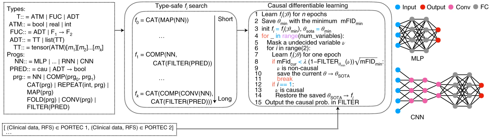

# AutoCI
Official PyTorch implementation for the following manuscript:

[Automated causal inference in application to randomized controlled clinical trials](https://www.nature.com/articles/s42256-022-00470-y), Nature Machine Intelligence (2022). \
Jiqing Wu, Nanda Horeweg, Marco de Bruyn, Remi A. Nout, Ina M. Jürgenliemk-Schulz, Ludy C.H.W. Lutgens, Jan J. Jobsen, Elzbieta M. van der Steen-Banasik, Hans W. Nijman, Vincent T.H.B.M. Smit, Tjalling Bosse, Carien L. Creutzberg, and Viktor H. Koelzer.


> Randomized controlled trials (RCTs) are considered as the gold standard for testing causal hypotheses in the clinical domain. However, the investigation of prognostic variables of patient outcome in a hypothesized cause-effect route is not feasible using standard statistical methods. Here, we propose a new automated causal inference method (AutoCI) built upon the invariant causal prediction (ICP) framework for the causal re-interpretation of clinical trial data. Compared to existing methods, we show that the proposed AutoCI allows to efficiently determine the causal variables with a clear differentiation on two real-world RCTs of endometrial cancer patients with mature outcome and extensive clinicopathological and molecular data. This is achieved via suppressing the causal probability of non-causal variables by a wide margin. In ablation studies, we further demonstrate that the assignment of causal probabilities by AutoCI remain consistent in the presence of confounders. In conclusion, these results confirm the robustness and feasibility of AutoCI for future applications in real-world clinical analysis.

<p align="center">
  
<br>
The overall model illustration and performance of the proposed AutoCI.       
</p>

<a href="https://arxiv.org/pdf/2201.05773.pdf"></a> \
<a href="https://opensource.org/licenses/MIT"></a>  


## Installation
This implementation is dependent on heavily refactored [HOUDINI](https://github.com/trishullab/houdini) and libraries from [AICP](https://github.com/juangamella/aicp). While [HOUDINI](https://github.com/trishullab/houdini) is compatible to a large variety of PyTorch versions, the libraries that are refactored from [AICP](https://github.com/juangamella/aicp.) require certain specific packages.

**Prerequisites**    
This implementation has been successfully tested under the following configurations,
while these configurations could be downgraded to a wide range of earlier versions:

- Ubuntu 20.04
- Nvidia driver 470.86
- CUDA 11.4
- Python 3.9
- Miniconda 
- Docker 
- Nvidia-Docker2

After the prerequisites are satisfied, you could either build the docker image
or install conda dependencies.

**Docker Installation**     
Assume Docker and Nvidia-Docker2 toolkit are correctly installed, build the Docker image as follows

```
cd /Path/To/AutoCI/
docker build -t autoci .
```

**Conda Installation**      
Assume a local Conda environment is installed and activated, 
install the dependencies as follows   

```
conda install pytorch torchvision torchaudio cudatoolkit=11.3 -c pytorch

pip install scipy pandas pycox pylatex pygam pyaml pyreadstat matplotlib scikit-learn termcolor sklearn joblib lifelines  networkx==2.4 sempler==0.1.1
```
You could also try creating a conda environment from [environment.yml](environment.yml).


## Data Preparation
Download the following toy datasets and unzip them resp.:   
- Finite sample setting  
    - [0 confounder](https://zenodo.org/records/10042871/files/fin.zip?download=1)
    - [1 confounder](https://zenodo.org/records/10042871/files/fin1.zip?download=1)
    - [2 confounders](https://zenodo.org/records/10042871/files/fin2.zip?download=1)
- ABCD setting  
    - [0 confounder](https://zenodo.org/records/10042871/files/abcd.zip?download=1)
    - [1 confounder](https://zenodo.org/records/10042871/files/abcd1.zip?download=1) 
    - [2 confounders](https://zenodo.org/records/10042871/files/abcd2.zip?download=1)

## Run the Experiments
In case of using Docker image, you could first launch the Docker image

**Launch the Docker Image**
```
sudo docker run -it \
    -v /Path/to/AutoCI:/root/AutoCI \
    -v /Path/to/Data/:/root/Data \
    --gpus '"device=0"'  autoci
```


**Run the AutoCI experiments**
```
cd /Path/To/AutoCI/

python -m HOUDINI.Run.LGANM --lganm-dir /Path/to/Data \
                            --res-dir /Path/to/Result  
```

**Run the (N)ICP experiments**
```
cd /Path/To/AutoCI/

python -m HOUDINI.Run.baseline_lganm --lganm-dir /Path/to/Data \
                                     --res-dir /Path/to/Result \
                                     --method nicp (or icp)
```
**Run the AICP experiments**    
See [AICP](https://github.com/juangamella/aicp) repository for more details.

## Tipps for training models without program synthesis  
If you want to train the neural network model while excluding the program sythesis module, then you could refactor the following codes to obtain simple neural network training codes:     
- [HOUDINI/Interpreter/Interpreter.py](HOUDINI/Interpreter/Interpreter.py): includes the core training functions
- [HOUDINI/Library/NN.py](HOUDINI/Library/NN.py): includes the simple neural network components
- [HOUDINI/Run/LGANM.py](HOUDINI/Run/LGANM.py): includes the critical training parameters and data loader functions


## Acknowledgement
This implementation is built upon [HOUDINI](https://github.com/trishullab/houdini). Besides, we borrow codes from [AICP](https://github.com/juangamella/aicp).
We would like to convey our gratitudes to all the authors working on those projects.
